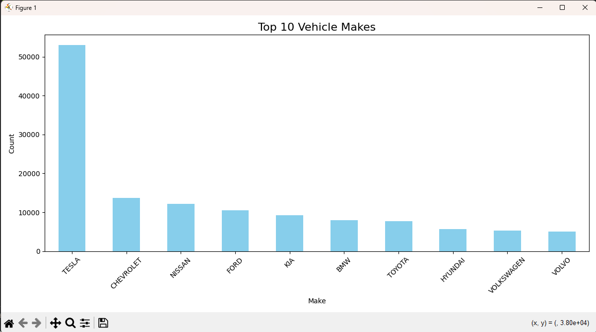

# Plan of Action: Exploratory Data Science project on Electric Vehicle Population Data

**My Objective**
The primary goal is to analyze and visualize the Electric Vehicle Population dataset to uncover trends, patterns, and insights using Python. The analysis will involve data cleaning, exploration, and answering key questions related to electric vehicles.

---

## **Steps to Complete the Project**

### 1️ **Dataset Acquisition**
- Source the Electric Vehicle Population dataset from Data.Gov.
- [Electric Vehicle Population Data](https://catalog.data.gov/dataset/electric-vehicle-population-data)
- Saved the dataset in a suitable format for easy manipulation with Python.

### 2️ **Data Preprocessing**
- **Load Data**:
  - Import the dataset into a Pandas DataFrame.
- **Inspect the Dataset**:
  - Check for null values, duplicates, and inconsistencies.
  - Understand the structure of the dataset by exploring columns, data types, and basic statistics.
- **Handle Missing Values**:
  - Decide on appropriate strategies (e.g., imputation or removal).
- **Data Cleaning**:
  - Standardize column names and formats.
  - Fix or remove invalid entries.

---

### 3️ **Exploratory Data Analysis (EDA)**
- **Initial Exploration**:
  - Use Pandas to calculate descriptive statistics (e.g., mean, median, mode).
  - Explore correlations between variables.
- **Data Visualization**:
  - Create static graphs with Matplotlib and Seaborn to identify trends and distributions.
  - Use Plotly for interactive visualizations to explore data dynamically.

---

### 4️ **Ask and Answer Key Questions**
- Identify interesting questions to analyze, such as:
  - Which electric vehicle models are most popular?
  - What is the growth trend of electric vehicles over the years?
  - How does the availability of charging stations vary geographically?
- Use visualizations and summary statistics to answer these questions.

---

### 5️ **Document Findings**
- Summarize key insights and observations from the dataset.

- Highlight actionable conclusions based on the analysis.

---

### 6️ **Project Presentation**
- Host the project notebook on Jovian for easy sharing and accessibility.
- Ensure the GitHub repository includes:
  - A detailed README.md file.
  - Instructions on how to replicate the analysis.
  - A link to the Jovian notebook for complete visualizations.

---

## **Tools and Libraries**
- **Data Manipulation**: Pandas, NumPy
- **Visualization**: Matplotlib, Seaborn, Plotly
- **Notebook Hosting**: Jovian
- **Dataset Source**: Kaggle

---

## **Expected Outcomes**
- A clean, well-documented dataset ready for analysis.
- Insights into electric vehicle trends and patterns.
- Interactive and static visualizations for clear storytelling.
